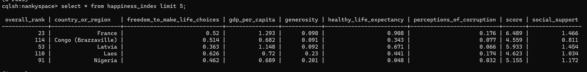

# Spark and Cassandra Integration in Scala

  

 

This project demonstrates how to integrate Apache Spark and Apache Cassandra using Scala programming language.

## Dependencies
The following dependencies are required for this project:

    Apache Spark 3.0 or later
    DataStax Cassandra Connector 3.0 or later

## Getting Started
To run the project, follow these steps:

 1.Clone the repository to your local machine.   
 2.Set up a Cassandra cluster and create a keyspace and table.Here's an example of how to create a simple table in Cassandra:

`CREATE KEYSPACE IF NOT EXISTS nankyspace
WITH replication = {'class': 'SimpleStrategy', 'replication_factor': '1'};`

`CREATE TABLE happiness_index(
Overall_rank int PRIMARY KEY,
Country_or_region text,
Score float,
GDP_per_capita float,
Social_support float,,
Healthy_life_expectancy float,
Freedom_to_make_life_choices float,
Generosity float,
Perceptions_of_corruption float
);`

 3.Make sure the cluster is reachable from the machine running the Spark application.

4. Reading from Cassandra

  

 

5. Writing to Cassandra

  

 

## Code Structure
src/main/scala/com/example/Spark_Cassandra_Integration.scala: The main Spark application that integrates with Cassandra and performs some data manipulation.

## Contributing
Contributions are welcome! If you have any ideas or improvements, please submit a pull request or open an issue.

## Acknowledgments
The Apache Spark and Apache Cassandra communities for providing excellent documentation and support.
DataStax for providing the Cassandra Connector for Spark.

